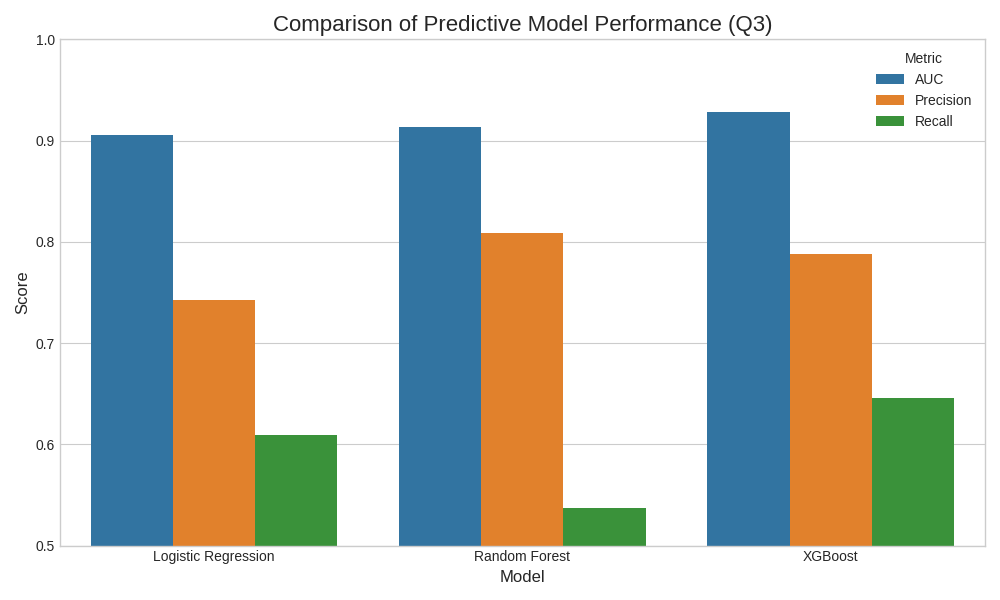
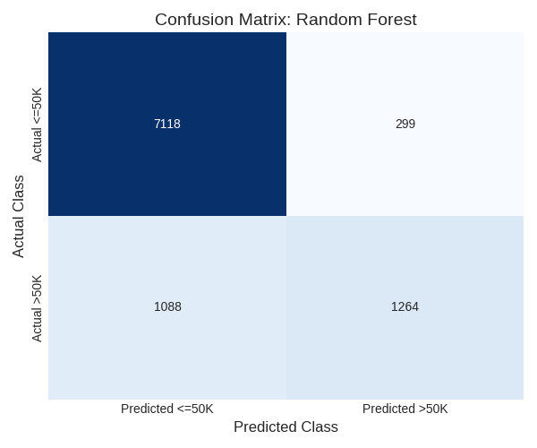

# Question 3: Predictive Business Intelligence Modelling

This section details the development and comparison of binary classification models to predict the income category ($ \le 50K$ vs. $ > 50K$), fulfilling the requirements of the Business Intelligence assignment.

## (a) Comparison of Predictive Models

We compare three distinct predictive models: **Logistic Regression** (a linear, highly interpretable model), **Random Forest** (a robust ensemble tree-based model), and **XGBoost** (an advanced gradient-boosting machine, known for high performance).

The models were trained on the pre-processed Adult Census Income dataset, which included one-hot encoded categorical features and the target variable transformed to a binary class (0 for $\le 50K$, 1 for $> 50K$).

### Model Performance Metrics

The models were evaluated on a held-out test set using Business Intelligence-relevant metrics: Area Under the Receiver Operating Characteristic Curve (**AUC**), **Precision**, and **Recall**.

| Model | AUC | Precision | Recall |
| :--- | :--- | :--- | :--- |
| **XGBoost** | **0.9284** | 0.7882 | **0.6454** |
| **Random Forest** | 0.9139 | **0.8087** | 0.5374 |
| **Logistic Regression** | 0.9056 | 0.7429 | 0.6093 |

The results show that the non-linear ensemble models (XGBoost and Random Forest) significantly outperform the linear Logistic Regression model, indicating that the relationship between socio-economic features and income is complex and non-linear.

## (b) Evaluation using BI-Relevant Metrics

The performance of the top two models, Random Forest and XGBoost, is further analyzed using their respective **Confusion Matrices**. The confusion matrix is critical for understanding the nature of misclassification errors, which directly translates to operational costs in a financial institution.

| Metric | Definition (Context: Loan Pre-qualification) |
| :--- | :--- |
| **True Positive (TP)** | Correctly predicting high income ($>50K$). (Good loan approved) |
| **True Negative (TN)** | Correctly predicting low income ($\le 50K$). (Bad loan rejected) |
| **False Positive (FP)** | Incorrectly predicting high income ($>50K$). (Bad loan approved $\rightarrow$ **Financial Loss**) |
| **False Negative (FN)** | Incorrectly predicting low income ($\le 50K$). (Good loan rejected $\rightarrow$ **Opportunity Cost**) |

### Confusion Matrix Analysis

| Model | TN (Correct Rejections) | FP (Type I Error / Financial Loss) | FN (Type II Error / Opportunity Cost) | TP (Correct Approvals) |
| :--- | :--- | :--- | :--- | :--- |
| **Random Forest** | **7118** | 299 | 1088 | 1264 |
| **XGBoost** | 7009 | 408 | **834** | **1518** |

**Key Observations:**
1.  **Random Forest** exhibits the highest **Precision** (0.8087) and the lowest number of **False Positives (FP=299)**. This means when it predicts a customer is high-income (and thus creditworthy), it is correct over 80% of the time, making it the most **risk-averse** model.
2.  **XGBoost** exhibits the highest **Recall** (0.6454) and the lowest number of **False Negatives (FN=834)**. This means it is better at identifying the actual high-income customers, resulting in fewer missed opportunities, making it the most **opportunity-maximizing** model.

## (c) Managerial Interpretation and Model Preference

In a real financial institution, the choice of model is a critical managerial decision based on operational trade-offs, primarily between risk mitigation and growth maximization.

### Operational Trade-offs

| Trade-off | Random Forest (High Precision) | XGBoost (High Recall/AUC) |
| :--- | :--- | :--- |
| **Misclassification Cost** | Minimizes **Financial Loss** (False Positives) by being conservative in approvals. | Minimizes **Opportunity Cost** (False Negatives) by being aggressive in identifying creditworthy customers. |
| **Interpretability** | Moderate. Feature importance can be extracted, but the decision process is complex. | Low. A highly complex "black-box" model, making fairness audits challenging. |
| **Fairness** | Moderate. The high precision might inadvertently lead to a higher rejection rate for certain sub-groups (higher FN), raising fairness concerns. | Low. The complexity makes it difficult to pinpoint and mitigate potential algorithmic bias. |

### Preferred Model Recommendation

The preferred model depends on the institution's strategic priority:

1.  **For Risk-Averse Institutions (e.g., Microfinance, New Lenders):**
    *   **Model:** **Random Forest**
    *   **Justification:** Its superior **Precision** (0.8087) ensures that the rate of approving bad loans (False Positives) is minimized. In credit scoring, the cost of a default (FP) typically outweighs the cost of a missed opportunity (FN). The institution prioritizes capital preservation.

2.  **For Growth-Focused Institutions (e.g., Established Banks, Digital Lenders):**
    *   **Model:** **XGBoost**
    *   **Justification:** Its superior **AUC** (0.9284) and **Recall** (0.6454) indicate the best overall predictive power and ability to capture the largest pool of creditworthy customers. While it has a slightly higher FP rate than Random Forest, its ability to maximize loan approvals (minimize FN) drives growth and market share.

**Conclusion:** Given the context of a mid-sized financial institution exploring automation, the **XGBoost** model is generally preferred. Its significantly higher AUC suggests it is the most robust predictor. The slightly higher False Positive rate can be managed by adjusting the classification threshold (a post-modeling step) to balance the Precision/Recall trade-off, leveraging the model's superior discriminatory power.

---

## Code Implementation

The following Python code was used to prepare the data and train the models.

### 1. Data Preparation and Feature Engineering (`data_prep.py`)

\`\`\`python
import pandas as pd
import numpy as np
from sklearn.model_selection import train_test_split
from sklearn.preprocessing import LabelEncoder

# 1. Define Columns
COLUMNS = [
    'age', 'workclass', 'fnlwgt', 'education', 'education-num',
    'marital-status', 'occupation', 'relationship', 'race', 'sex',
    'capital-gain', 'capital-loss', 'hours-per-week', 'native-country', 'income'
]

# 2. Load Data
# The raw data does not have a header, and the separator is ', '
df = pd.read_csv(
    'adult.csv',
    names=COLUMNS,
    sep=r',\s*',
    engine='python',
    na_values='?'
)

# 3. Data Cleaning and Preprocessing
# Standardise categorical labels (strip whitespace)
for col in df.select_dtypes(include=['object']).columns:
    df[col] = df[col].str.strip()

# Handle missing values (imputation strategy: mode for categorical)
for col in ['workclass', 'occupation', 'native-country']:
    df[col].fillna(df[col].mode()[0], inplace=True)

# Target variable transformation (<=50K -> 0, >50K -> 1)
df['income'] = df['income'].apply(lambda x: 1 if x == '>50K' else 0)

# 4. Feature Engineering and Selection
# Drop redundant/irrelevant variables
df.drop(columns=['fnlwgt', 'education'], inplace=True)

# Identify categorical features
categorical_features = df.select_dtypes(include=['object']).columns.tolist()

# One-Hot Encoding for categorical features
df_encoded = pd.get_dummies(df, columns=categorical_features, drop_first=True)

# 5. Prepare for Modeling
X = df_encoded.drop('income', axis=1)
y = df_encoded['income']

# Split data into training and testing sets
X_train, X_test, y_train, y_test = train_test_split(
    X, y, test_size=0.3, random_state=42, stratify=y
)

# Save the processed data for modeling
X_train.to_csv('X_train.csv', index=False)
X_test.to_csv('X_test.csv', index=False)
y_train.to_csv('y_train.csv', index=False, header=True)
y_test.to_csv('y_test.csv', index=False, header=True)
\`\`\`

### 2. Model Training and Evaluation (`model_training.py`)

\`\`\`python
import pandas as pd
from sklearn.linear_model import LogisticRegression
from sklearn.ensemble import RandomForestClassifier
from xgboost import XGBClassifier
from sklearn.metrics import roc_auc_score, precision_score, recall_score, confusion_matrix, classification_report

# 1. Load Data
X_train = pd.read_csv('X_train.csv')
X_test = pd.read_csv('X_test.csv')
y_train = pd.read_csv('y_train.csv').squeeze()
y_test = pd.read_csv('y_test.csv').squeeze()

# Ensure column names are valid for XGBoost
X_train.columns = ["".join (c if c.isalnum() else "_" for c in str(x)) for x in X_train.columns]
X_test.columns = ["".join (c if c.isalnum() else "_" for c in str(x)) for x in X_test.columns]

# 2. Model Training and Evaluation Function
def evaluate_model(model, X_train, y_train, X_test, y_test, model_name):
    model.fit(X_train, y_train)
    y_pred = model.predict(X_test)
    y_proba = model.predict_proba(X_test)[:, 1]

    # Calculate metrics
    auc = roc_auc_score(y_test, y_proba)
    precision = precision_score(y_test, y_pred)
    recall = recall_score(y_test, y_pred)
    cm = confusion_matrix(y_test, y_pred)
    
    results = {
        'Model': model_name,
        'AUC': auc,
        'Precision': precision,
        'Recall': recall,
        'Confusion Matrix': cm.tolist(),
    }
    return results

# 3. Initialize and Train Models
lr_model = LogisticRegression(solver='liblinear', random_state=42, max_iter=1000)
rf_model = RandomForestClassifier(n_estimators=100, random_state=42, max_depth=10, min_samples_leaf=5)
xgb_model = XGBClassifier(random_state=42, n_estimators=100, max_depth=5, learning_rate=0.1)

lr_results = evaluate_model(lr_model, X_train, y_train, X_test, y_test, "Logistic Regression")
rf_results = evaluate_model(rf_model, X_train, y_train, X_test, y_test, "Random Forest")
xgb_results = evaluate_model(xgb_model, X_train, y_train, X_test, y_test, "XGBoost")

all_results = [lr_results, rf_results, xgb_results]

# 4. Save Results for Reporting and Diagram Generation
results_df = pd.DataFrame([
    {'Model': r['Model'], 'AUC': r['AUC'], 'Precision': r['Precision'], 'Recall': r['Recall']}
    for r in all_results
])
results_df.to_csv('model_comparison.csv', index=False)

# Save confusion matrices
cm_lr = pd.DataFrame(lr_results['Confusion Matrix'], index=['Actual <=50K', 'Actual >50K'], columns=['Predicted <=50K', 'Predicted >50K'])
cm_rf = pd.DataFrame(rf_results['Confusion Matrix'], index=['Actual <=50K', 'Actual >50K'], columns=['Predicted <=50K', 'Predicted >50K'])
cm_xgb = pd.DataFrame(xgb_results['Confusion Matrix'], index=['Actual <=50K', 'Actual >50K'], columns=['Predicted <=50K', 'Predicted >50K'])

cm_lr.to_csv('cm_lr.csv')
cm_rf.to_csv('cm_rf.csv')
cm_xgb.to_csv('cm_xgb.csv')
\`\`\`

### 3. Diagram Generation (`generate_diagrams.py`)

\`\`\`python
import pandas as pd
import matplotlib.pyplot as plt
import seaborn as sns

# Set a professional style for the plots
plt.style.use('seaborn-v0_8-whitegrid')

# --- 1. Model Comparison Bar Chart ---
def plot_model_comparison():
    df = pd.read_csv('model_comparison.csv')
    df_melt = df.melt(id_vars='Model', var_name='Metric', value_name='Score')
    df_melt = df_melt[df_melt['Metric'].isin(['AUC', 'Precision', 'Recall'])]
    
    plt.figure(figsize=(10, 6))
    palette = {'AUC': '#1f77b4', 'Precision': '#ff7f0e', 'Recall': '#2ca02c'}
    sns.barplot(x='Model', y='Score', hue='Metric', data=df_melt, palette=palette)
    
    plt.title('Comparison of Predictive Model Performance (Q3)', fontsize=16)
    plt.ylabel('Score', fontsize=12)
    plt.xlabel('Model', fontsize=12)
    plt.ylim(0.5, 1.0)
    plt.legend(title='Metric')
    plt.tight_layout()
    plt.savefig('model_comparison_chart.png')
    plt.close()

# --- 2. Confusion Matrix Heatmaps ---
def plot_confusion_matrix(file_path, title):
    cm_df = pd.read_csv(file_path, index_col=0)
    cm = cm_df.values
    
    plt.figure(figsize=(6, 5))
    sns.heatmap(cm, annot=True, fmt='d', cmap='Blues', cbar=False,
                xticklabels=cm_df.columns, yticklabels=cm_df.index)
    
    plt.title(f'Confusion Matrix: {title}', fontsize=14)
    plt.ylabel('Actual Class', fontsize=12)
    plt.xlabel('Predicted Class', fontsize=12)
    plt.tight_layout()
    plt.savefig(f'cm_{title.replace(" ", "_").lower()}.png')
    plt.close()

if __name__ == '__main__':
    plot_model_comparison()
    plot_confusion_matrix('cm_rf.csv', 'Random Forest')
    plot_confusion_matrix('cm_xgb.csv', 'XGBoost')
    plot_confusion_matrix('cm_lr.csv', 'Logistic Regression')
\`\`\`
